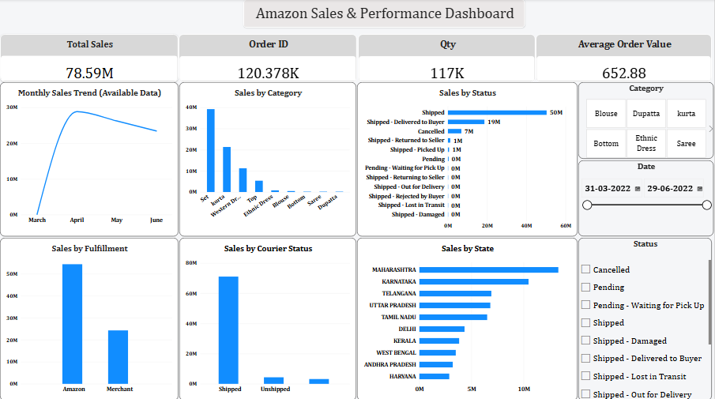

# Amazon Sales & Performance Dashboard

An interactive Power BI dashboard designed to analyze Amazon sales performance, orders, product categories, fulfillment, courier status, and state-wise sales.

## Dashboard Preview

## Key KPIs

- Total Sales: 78.59M
- Total Orders: 120.378K
- Total Quantity: 117K
- Average Order Value: 652.88

## Dashboard Insights

- Monthly sales trend across available data
- Sales performance by product category
- Order status analysis
- Sales by fulfillment method
- Courier status analysis
- State-wise sales performance
- Interactive filters for Category, Date, and Status

## Tools & Technologies

- Power BI
- MySQL
- SQL
- Python
- Jupyter Notebook
- Data Analysis
- Data Visualization

## Project Files

- Power BI Dashboard (`.pbix`)
- Jupyter Notebook (`.ipynb`)
- SQL Analysis (`.sql`)
- Dashboard Preview (`.png`)
